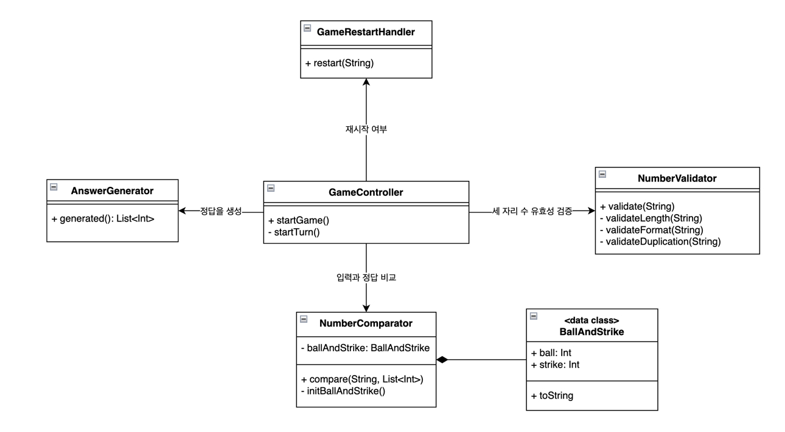
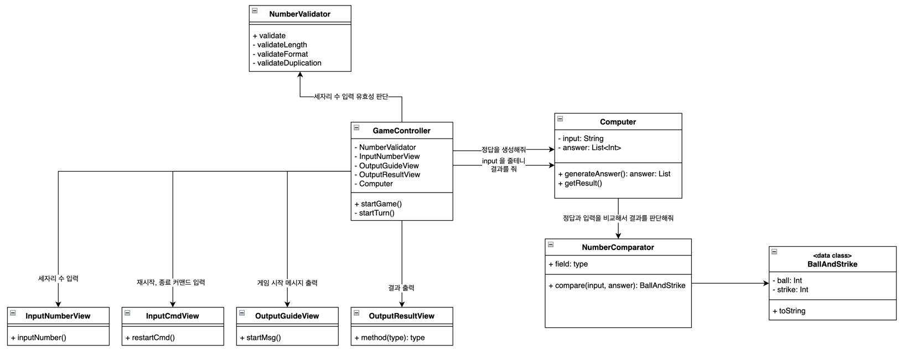

# 구현할 기능 목록

#### A. 컴퓨터는 사용자가 맞힐 정답을 생성한다.

1. 컴퓨터는 1 부터 9까지 서로 다른 수로 이루어진 3자리 수를 생성한다.

#### B. 사용자의 수를 입력 받는다.

1. 사용자는 서로 다른 3자리의 수를 입력한다.
2. 사용자의 입력의 유효성을 검증한다.
    * 입력에 1~9 사이 숫자가 아닌 문자가 들어갈 경우
    * 입력이 3 자리 수가 아닌 경우
    * 입력에 중복된 수가 있을 경우

#### C. 정답과 사용자의 입력을 비교해서 결과를 반환한다.

1. 모두 맞혔을 경우
    1. 사용자가 1 을 입력 --> A 로 다시 돌아간다.
    2. 사용자가 2 를 입력 --> 게임을 완전히 종료.
2. 모두 맞히지 못했을 경우
    1. '낫싱' , '~볼~스트라이크' 등을 상황에 맞게 출력.
    2. B 로 다시 돌아간다.

#### D. 게임을 재시작한다.

# 1차로 리팩토링한 결과

* `GameController`
    * 여러 역할을 담당하는 것들을 사용하는 컨트롤러
* `AnswerGenerator`
    * 정답을 생성해주는 역할 담당
* `NumberValidator`
    * 입력한 세자리 수를 검증해주는 역할 담당
* `NumberComparator`
    * `BallAndStrike` 데이터 클래스를 합성하고 있음
    * 입력과 정답을 비교해서 볼과 스트라이크를 결정해주는 역할
* `BallAndStrike`
    * `ball` 과 `strike` 를 가짐.
    * `toString` 을 오버라이드 해서 출력시 형식에 맞춰주는 역할
* `GameRestartHandler`
    * 입력한 커맨드에 따라 재시작 여부를 판단해주는 역할.
    * 입력한 커맨드의 유효성도 판단해줌.
* `GameConfig`
    * 게임에서 입력할 숫자의 자리수를 설정해줌.
    * 게임에서 입력할 숫자의 시작 범위와 끝 범위를 설정해줌.
    * 나중에 숫자 자리수와 범위가 변경되면 이 파일만 변경해주면 됨.

# 2차 리팩토링 설계 (MVC 패턴)

* **Model**
    * `Computer`
        * 세 자리수 입력과 정답을 프로퍼티로 가짐.
        * 무작위 정답을 생성.
        * 볼과 스트라이크를 Controller 에게 전달.
    * `NumberComparator`
        * 세 자리수 입력과 정답을 비교해서 결과를 리턴.
    * `BallAndStrike`
        * `ball` 과 `strike` 를 가짐.
        * `toString` 을 오버라이드 해서 출력시 형식에 맞춰주는 역할
* **View**
    * `InputNumberView`
        * 세자리 수 입력
    * `InputCmdView`
        * 재시작, 종료 커맨드 입력
    * `OutputGuideView`
        * 게임 시작 메시지 출력
    * `OutputResultView`
        * 각 Turn 의 결과 출력
* **Controller**
    * `GameController`
        * 여러 역할을 담당하는 것들을 사용하는 컨트롤러
* **Service**
    * `NumberValidator`
        * 입력한 세자리 수를 검증해주는 역할 담당
