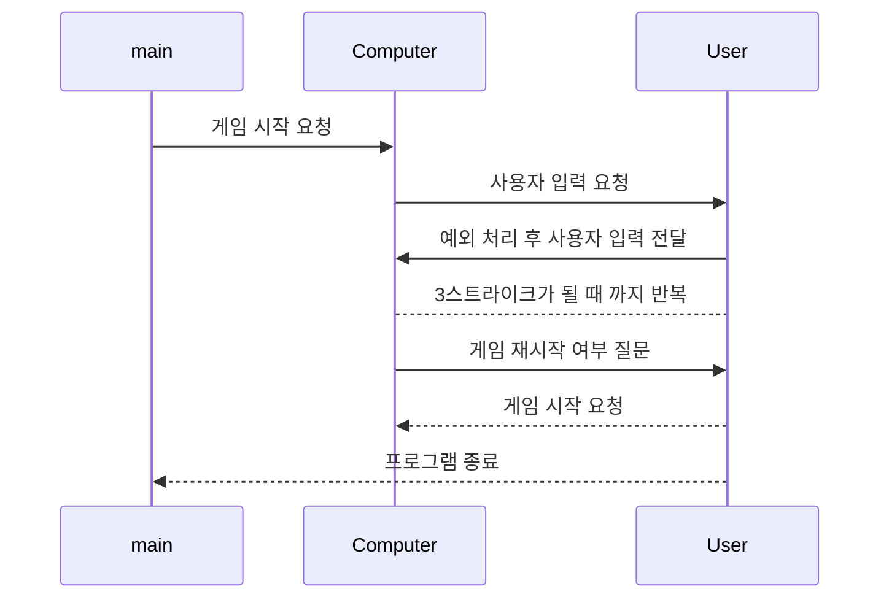

# Class

Computer 클래스와 User 클래스를 만들고 기능을 분리하여 구현
|     Class           |job                     |                        
|----------------|-------------------------------|
|Computer		|  랜덤 넘버 생성과 비교와 같은 게임 진행에 필요한 기능 구현|            
|User          | 사용자의 입력 및 예외 처리          |

이후 apllication의 main 함수에서 Computer 객체와 User 객체를 생성해 메소드를 활용
# Methods
각 클래별  메소드를 이름과 구현할 기능을 정리
### Computer
|       Methods        | job                     |                        
|----------------|-------------------------------|
|playGame|  숫자야구게임을 시작|            
|setRandomNumber | 랜덤 넘버를 설정          |           
|countStrike| 입력된 숫자의 Strike의 수를 카운트       |   
|countBall|  입력된 숫자의 Ball의 수를 카운트| 
|resultString|  strike의 수와 ball의 수를 통해 알맞은 출력을 결정|        
### User
|       Methods        | job                     |                        
|----------------|-------------------------------|
|inputNumber|  숫자를 입력 받고, 예외 처리|            
|playAgain| 게임 재시작 여부를 입력 받음         |             

# UML diagrams

